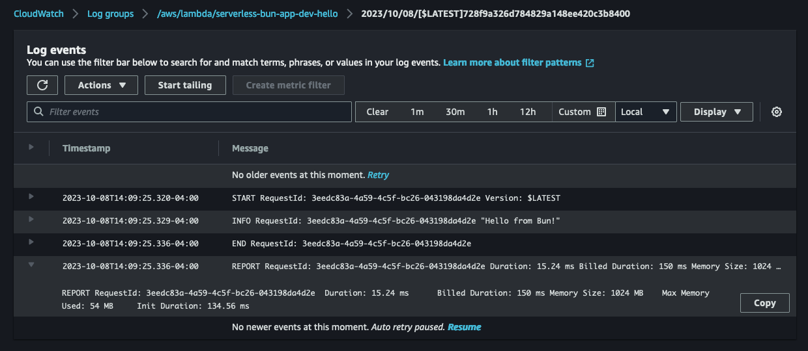

# lambda-bun-container
Deploy Bun to AWS Lambda using a custom runtime and container image.

Takes advantage of caching improvements for container images detailed in [On-Demand Container Loading in AWS Lambda](https://arxiv.org/pdf/2305.13162.pdf).

Init Duration is around 140ms:



# Deployment
```console
$ npm i -g serverless
$ cd serverless-bun-app
$ serverless deploy
```
